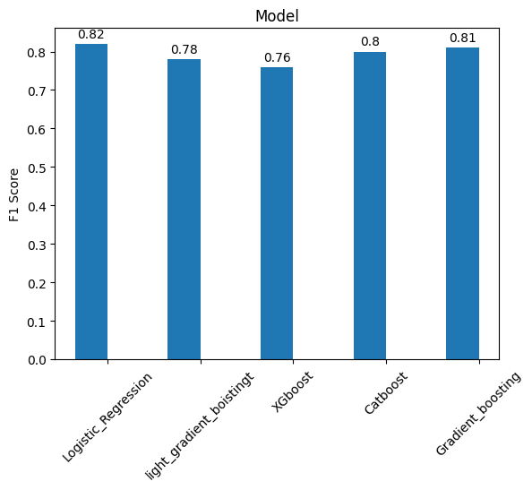
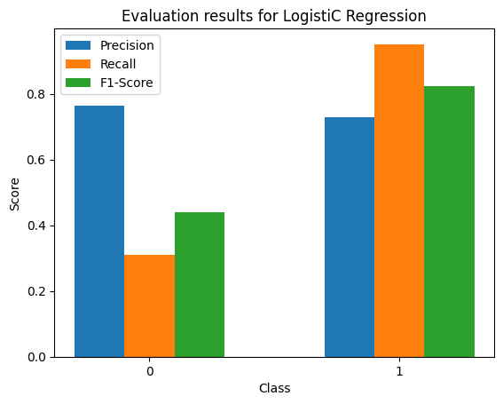
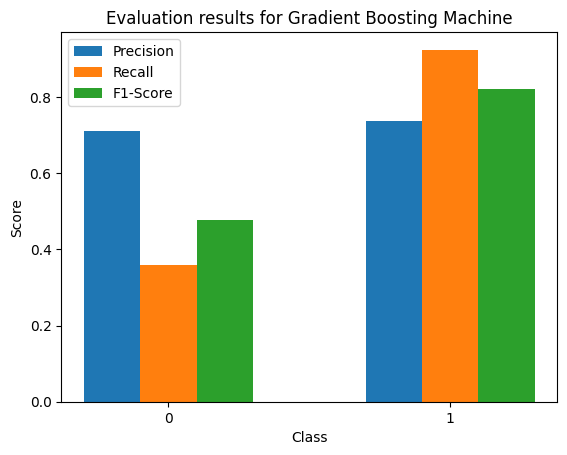

# CLIMDES Internship Application Prediction Project

## Overview
This project aims to predict the success of internship applications for the CLIMDES Internship program using advanced machine learning techniques. It involves generating a simulated dataset, cleaning and preprocessing data, building and evaluating a model, tuning hyperparameters, and deploying the model with explainability features.

## Table of Contents
- [Data Simulation](#data-simulation)
- [Data Cleaning and Preprocessing](#data-cleaning-and-preprocessing)
- [Model Building](#model-building)
- [Hyperparameter Tuning](#hyperparameter-tuning)
- [Model Deployment and Explainability](#model-deployment-and-explainability)

## Data Simulation
### Simulate a Dataset
- *Objective:* Generated a dataset mirroring real-world internship applications, factoring in academic performance, skills, and other relevant attributes.
- *Target Variable:* A binary indicator (1 for success, 0 for failure) representing the outcome of internship applications.
- *Methodology:* A custom simulation code was developed to create a balanced and unbiased dataset. This involved conditional weighting to ensure a realistic distribution of features and outcomes.

## Data Cleaning and Preprocessing
### Data Preparation
- *Handling Missing Values:* Strategies such as imputation or removal, based on the nature and extent of missing data.
- *Data Type Consistency:* Conversion and normalization of data types for computational efficiency.
- *Categorical Encoding:* One-hot encoding was used for the categorical data.

## Model Building
### Model Selection
- *Approach:* Evaluated various machine learning algorithms (like Logistic Regression, Xgboosts, Catboost, Lightgradient boosting machine, gradient boosting machine and RandomForest ) to identify the most suitable model based on dataset characteristics. Logistic Regression and Gradient boosting were the best predictive models after running Cross-validation using a total of 10 folds.

### Model Training and Evaluation
- *Data Splitting:* Utilization of a standard 80-20 split for training and testing.
- *Training Approach:* Application of cross-validation and other robust training methods.
- *Evaluation Metrics:* Primary focus on F1 score, supplemented by precision and recall to provide a balanced view of model performance.
  
                    

## Hyperparameter Tuning
### Optimization with Optuna
- *Process:* Implemented Optuna for efficient hyperparameter tuning, exploring a range of values to find the optimal configuration.
- *Analysis:* Detailed examination of how changes in hyperparameters like learning rate, tree depth (for tree-based models), or regularization parameters influence model accuracy and generalization.
After carrying out Optimization using a total of 100 trials the Catboost improved and yielded to approximately 84% f1_Score which happens to be the best score throughout the experiment. 

## Model Deployment and Explainability
### Deployment
- *Method:* The model was elucidated through a straightforward Streamlit interface designed for user interaction to facilitate predictions.

### Explainability
- *SHAP Values:* Application of SHAP (SHapley Additive exPlanations): The Streamlit interface now incorporates SHAP values for model explainability, allowing users to understand decision-making processes and the impact of each feature on model predictions.
